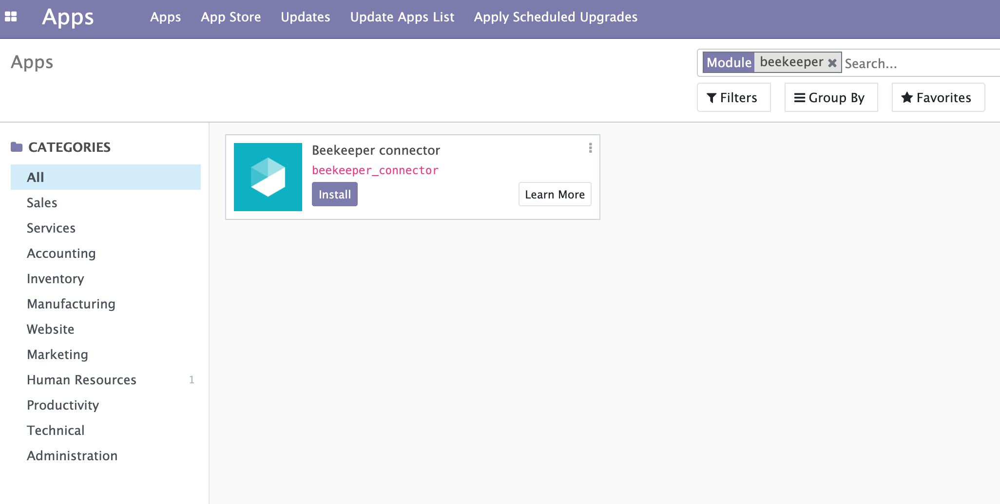
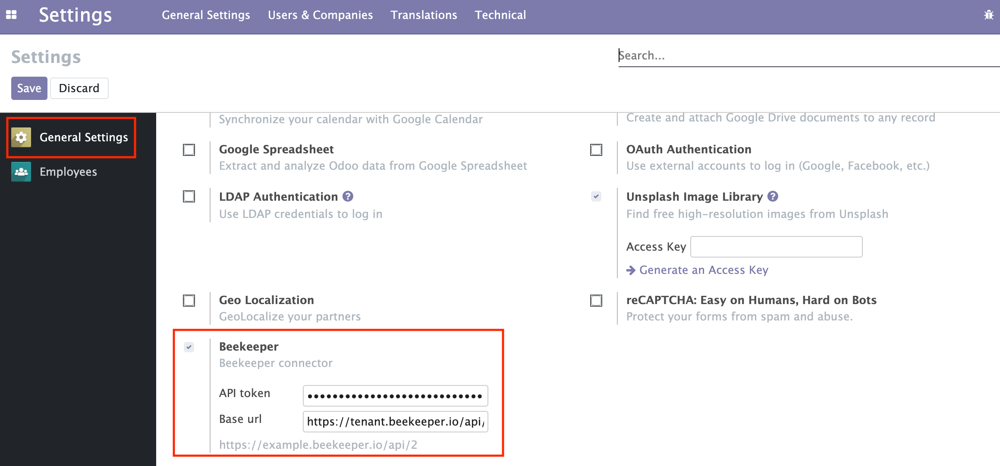
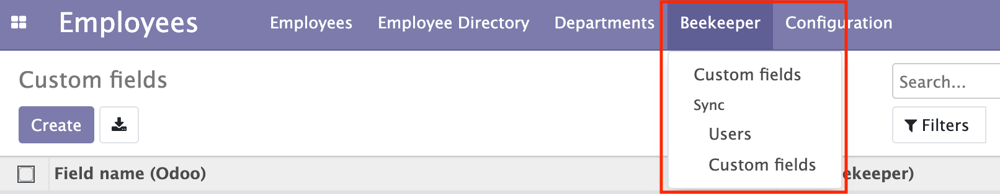
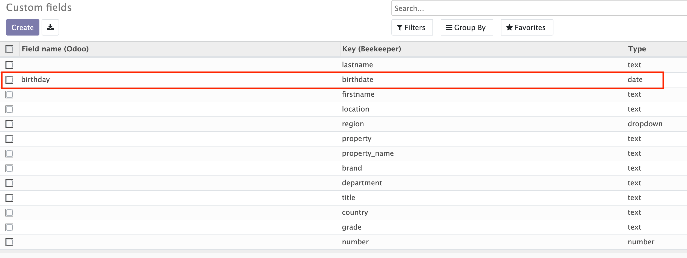
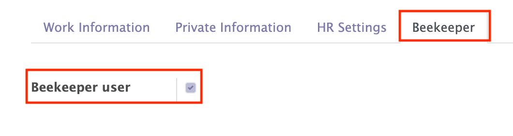
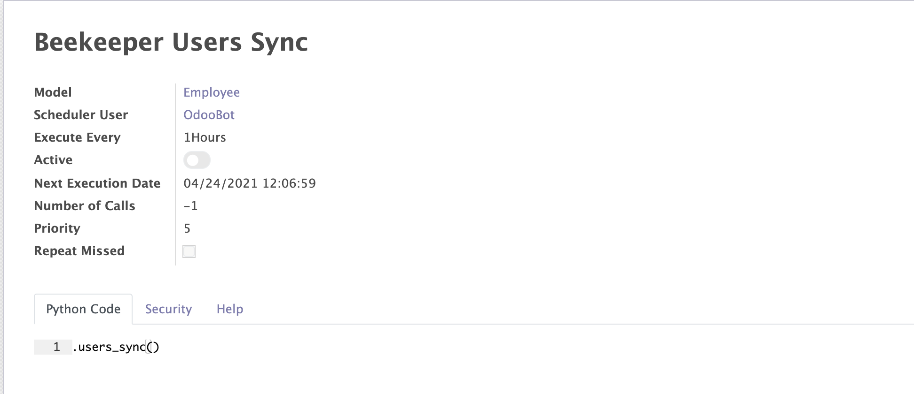

## Beekeeper connector

Beekeeper connector allows to synchronise employees between Odoo and Beekeeper.

This module depends on Python libraries: json,requests.

Install Beekeeper app.

Set API token and base URL in Settings.

In the Employee's section will appear a new menu: "Beekeeper" with two submenus: Custom fields and Sync.

Custom fields: in this tab you can check imported custom fields from Beekeeper and map them manually with Odoo's field names. For example: in Beekeeper custom field has a key: "birthdate" but in Odoo it's a field: "birthday".

Sync: in this submenu you can run manually Users/Custom fields synchronisation.

Employees with selected "Beekeeper user" field will be synchronised only.

Automation (cron): in scheduled actions will appear "Beekeeper User Sync" cron, which by default is disabled and allows to synchronise custom fields/users based on time trigger.

